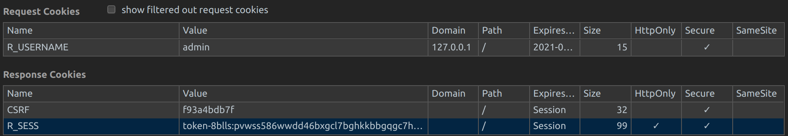

<h2 id="auth">Authentication</h2>

<h3 id="local-auth">1.0 Logging into Rancher Locally</h3>

  <strong>1.1 API Route:</strong> 
  ``` 
  https://127.0.0.1/login
  
  ```

  <strong>1.2 Query String Params:</strong>
  ``` 
  action: login 
  
  ```

  <strong>1.3 Fully Qualified Route:</strong> 
  ``` 
  https://127.0.0.1/v3-public/localProviders/local?action=login 
  
  ```

  <strong>1.4 Payload:</strong>
  ```
  {
    username: "admin"
    password: "supersecret"
    description: "UI Session"
    responseType: "cookie"
    ttl: 57600000
    labels: {ui-session: "true"}
    ui-session: "true"
  }
  ```
    
  <strong>1.5 CRSF and Session Cookies</strong>
  
  In the header requests, you'll need add (as all one line): 
   ```
   Cookie: R_USERNAME=admin; 
   CSRF=f93a4bdb7f; 
   R_SESS=token-8blls:pvwss586wwdd46bxgcl7bghkkbbgqgc7hqgkx9rzsw65sgbsd5wzmt
   ```
  
  

  <strong>1.6 Local Auth REST API schema:</strong>
```
{
  "actions": {
  "login": "…/v3-public/localProviders/local?action=login"
},
  "baseType": "authProvider",
  "creatorId": null,
  "id": "local",
  "links": {
  "self": "…/v3-public/localProviders/local"
},
  "type": "localProvider"
}
 ```
 
 ---
 
<h3 id="create-api-key">2.0 Create API Key</h3>

This is so you can retrieve the beaerer token and interact as an authorized user.

  <strong>2.1 API Route:</strong> 
  ``` 
   Request URL: https://127.0.0.1/v3/token
   Request Method: POST
  
  ```

  <strong>2.2 Payload:</strong>
  ```
  {
    current: false
    enabled: true
    expired: false
    isDerived: false
    ttl: 31622400000
    type: "token"
    description: "user_token"
    clusterId: "c-wz94t"
  }
  ```
  
  <strong>2.2 Response: </strong>
  
  Towards the bottom of the reponse object, (listed below), you will see:
  
  ```
  "token":"token-x69qs:twfj42hfbqhr2zqffrwvr5l2n5jz64rvwjbrh8tz266skv8wswxrmv"
  ```
  
  That is the bearer token you will recieve, and subsequently use with every API call for access.
  
  ```
  { 
   "authProvider":"local",
   "baseType":"token",
   "clusterId":"c-wz94t",
   "created":"2020-02-13T13:16:50Z",
   "createdTS":1581599810000,
   "creatorId":null,
   "current":false,
   "description":"user_token",
   "enabled":true,
   "expired":false,
   "expiresAt":"",
   "groupPrincipals":null,
   "id":"token-x69qs",
   "isDerived":true,
   "labels":{ 
      "authn.management.cattle.io/token-userId":"user-x57rg",
      "cattle.io/creator":"norman"
   },
   "lastUpdateTime":"",
   "links":{ 
      "remove":"https://127.0.0.1/v3/tokens/token-x69qs",
      "self":"https://127.0.0.1/v3/tokens/token-x69qs",
      "update":"https://127.0.0.1/v3/tokens/token-x69qs"
   },
   "name":"token-x69qs",
   "token":"token-x69qs:twfj42hfbqhr2zqffrwvr5l2n5jz64rvwjbrh8tz266skv8wswxrmv",
   "ttl":31622400000,
   "type":"token",
   "userId":"user-x57rg",
   "userPrincipal":"map[metadata:map[name:local://user-x57rg creationTimestamp:\u003cnil\u003e] displayName:Default Admin  
                    loginName:admin principalType:user me:true provider:local]",
   "uuid":"182bb3ea-4e63-11ea-8930-0242ac110002"
}
```


---
layout: default
---

Text can be **bold**, _italic_, or ~~strikethrough~~.

[Link to another page](./another-page.html).

There should be whitespace between paragraphs.

There should be whitespace between paragraphs. We recommend including a README, or a file with information about your project.

# Header 1

This is a normal paragraph following a header. GitHub is a code hosting platform for version control and collaboration. It lets you and others work together on projects from anywhere.

## Header 2

> This is a blockquote following a header.
>
> When something is important enough, you do it even if the odds are not in your favor.

### Header 3

```js
// Javascript code with syntax highlighting.
var fun = function lang(l) {
  dateformat.i18n = require('./lang/' + l)
  return true;
}
```

```ruby
# Ruby code with syntax highlighting
GitHubPages::Dependencies.gems.each do |gem, version|
  s.add_dependency(gem, "= #{version}")
end
```

#### Header 4

*   This is an unordered list following a header.
*   This is an unordered list following a header.
*   This is an unordered list following a header.

##### Header 5

1.  This is an ordered list following a header.
2.  This is an ordered list following a header.
3.  This is an ordered list following a header.

###### Header 6

| head1        | head two          | three |
|:-------------|:------------------|:------|
| ok           | good swedish fish | nice  |
| out of stock | good and plenty   | nice  |
| ok           | good `oreos`      | hmm   |
| ok           | good `zoute` drop | yumm  |

### There's a horizontal rule below this.

* * *

### Here is an unordered list:

*   Item foo
*   Item bar
*   Item baz
*   Item zip

### And an ordered list:

1.  Item one
1.  Item two
1.  Item three
1.  Item four

### And a nested list:

- level 1 item
  - level 2 item
  - level 2 item
    - level 3 item
    - level 3 item
- level 1 item
  - level 2 item
  - level 2 item
  - level 2 item
- level 1 item
  - level 2 item
  - level 2 item
- level 1 item

### Small image


### Large image


### Definition lists can be used with HTML syntax.

<dl>
<dt>Name</dt>
<dd>Godzilla</dd>
<dt>Born</dt>
<dd>1952</dd>
<dt>Birthplace</dt>
<dd>Japan</dd>
<dt>Color</dt>
<dd>Green</dd>
</dl>

```
Long, single-line code blocks should not wrap. They should horizontally scroll if they are too long. This line should be long enough to demonstrate this.
```

```
The final element.
```
